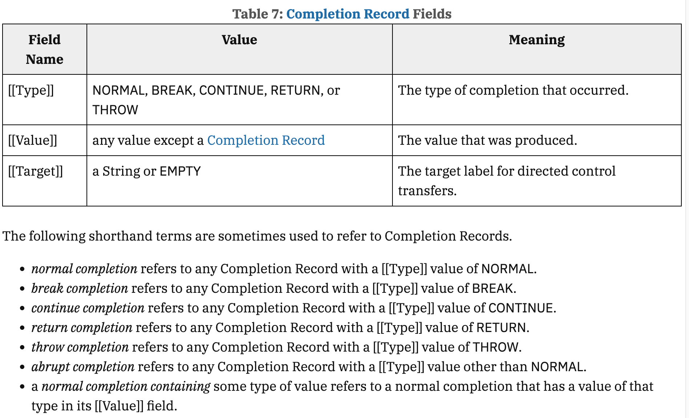
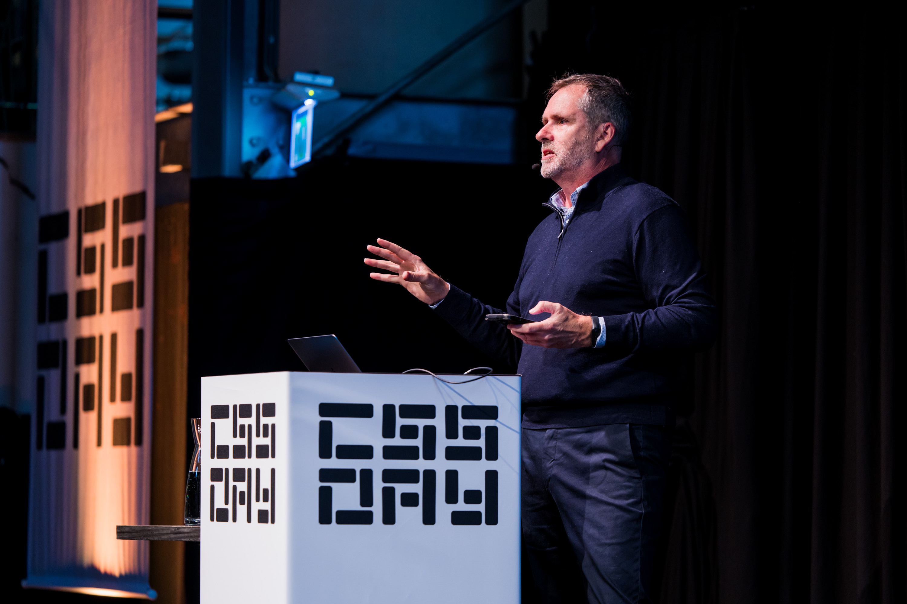
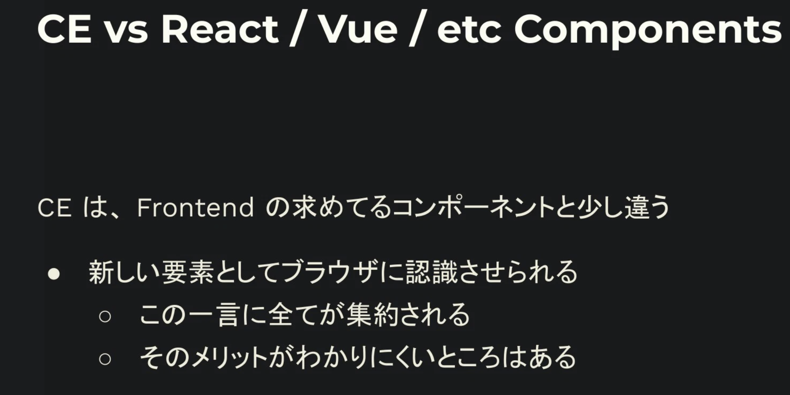
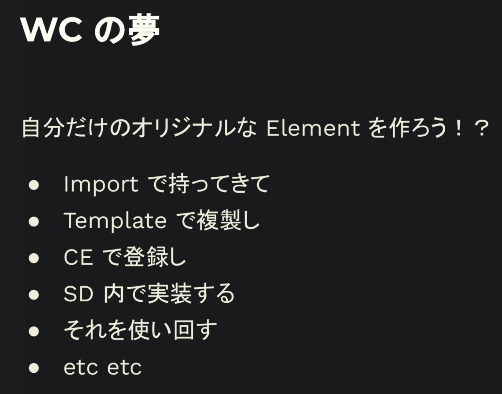

こんにちは！デザインテクノロジストをしている[saku (@sakupi01)](https://x.com/sakupi01)です。

2025/06/04~05 にオランダのアムステルダムで開催された CSSDay 2025 に参加してきました🎨✨

https://cssday.nl/

CSS Day は 2013 年から計 11 回開催されている、世界最大級の CSS に特化した伝統のあるカンファレンスです。例年、世界的にみても著名なエンジニアが登壇しています。

聴講したセッションのタイムライン順に軽いまとめ＆感想、スピーカーや参加者と個人的にディスカッションしたこと、CSSDay 2025 全体を通じた感想のまとめです。

備忘録がてらの事後記録のため、トークの詳細は書いていません。
スライドが公開されているものに関しては、各トークのセクションに添付しています。

---

# Day 1

MC: Stephen Hay

## 🌏 The Ultimate Scroller by Adam Argyle

CSS Scroll Behavior と Carousel を主に用いたスクロール実装方法のベストプラクティスに関するトークでした。

## 🌏 A Dao of CSS by John Allsopp

John Allsopp は、 2000 年に [A List Apart](https://alistapart.com/) で A Dao of Web Design を執筆し、レスポンシブデザインの元となる考え方を流布させたといっても過言ではない方です。

今回は、「A Dao of CSS」というタイトルで、CSS がどうあるべきかという哲学について考察したトークでした。

自身の A Dao of Web Design を元に、Web が、標準が、どのように Printed Design や多様なデバイスの登場と向き合ってきたかを振り返り、それによって CSS がどのような立ち位置を取ることになったのか考察します。これを元に、「The essence of the Web」として、7 つの CSS 基本原則を提唱し、CSS のあるべき姿を結論づけていました。

個人的に、John のトークは全体を通しても特に印象に残るものでした。
CSS は Web の特性を反映したものであり、Web があらゆるコンテキストを包含するという特性を理解することは、CSS 進化背景の理解を試みる上でも非常に役立つと感じました。

ちなみに、A Dao of Web Design は Web 標準の黎明を受けて Web Design を考察したもので、Printed Design と Web Design の違いを明確にするだけでなく、Web の特性に関する洞察が書かれています。25 年前の文章ですが、一読の価値があるものです。

https://alistapart.com/article/dao/

## 🌏 Is Sass Dead Yet? CSS Mixins & Functions by Miriam Suzanne

CSSWG の Invited Expert であり、Sass のコアコントリビュータである Miriam Suzanne が提案している CSS Functions and Mixins に関するトークでした。

トークのメインは、CSS エンジンのプロセスから、CSS Custom Properties、Functions、 Mixins が Sass のそれらとどのような点で異なるのかを解説したものでした。
「CSS is a Declarative Language」「There's no CSS Value Resolution system in Sass.」という点が主に強調されており、Q&A セッションでも「CSS という宣言的な言語にループや逐次的な処理を組み込むことはない。もし逐次処理をしたいなら Sass を使ってね。」という回答がありました。

Function や Mixin に関しての現場でのプラクティスが得られる感じのセッションかな〜と思っていたのですが、CSS 根底の仕組みを解説することで Sass との違いを明確にする、発展途上な技術のなかでも事実に基づいた見解を提供するような内容で、非常に興味深いものでした。Sass if、function、mixin の苦い背景から、これらを CSS でどのようにメンテナンスしていくのかがこれから問われていきそうですが、まず Sass と CSS での違いを理解するという重要なステップを踏ませてくれるものだったかなと思います。

CSS Functions は、執筆時点（2025/06/18）で、 Chrome Dev ビルドで利用可能です。ぜひ Working Group に FB を、とのことでした。
CSS Mixins に関しては、実装が不完全な状態ですが、Canary ビルドを `--enable-blink-features=CSSMixins` フラグを有効にして起動することで利用可能です。

また、Miriam Suzanne は Cascade Layers や Container Queries、Scope を提案したことでも著名な人物です。

Mia のトークは笑いの要素が散りばめられていて、聞いていて楽しかった〜！

## 🌏 Select it! Styling new HTML UI capabilities by Brecht De Ruyte

Open UI で Customizable Range Element などを進めている Brecht De Ruyte による、CSE (Customizable Select Element) に関するトークでした。

Form Controls の課題から CSE が提案された背景や、トップレイヤーと関連した要素のアニメーション、`<optgroup>` を用いた CSE のスタイリング、CSS Carousel との合わせ技などの紹介がありました。

https://slides.utilitybend.com/styling-select

CSE はアドベントカレンダーやカンファレンスで触れたこともあって、個人的に思い出深いトピックでした。

CSE は最近 Open UI で [Graduated Proposal となりつつあり](https://github.com/openui/open-ui/pull/1233#pullrequestreview-2911129787)、WHATWG でも [Stage 3](https://github.com/whatwg/html/issues/9799) に到達しています。また、Day2 の Tim の発表にも関連しますが、CSE は [CSS Form Controls Module Level 1](https://www.w3.org/TR/css-forms-1/) で進められている `appearance: base;` でオプトイン可能な Form Controls の一つであり、現状 `appearance: base-select;` でオプトインできる CSE はそのプレビュー版的な位置付けです。

2025/06/18 現在、 CSE は Single Select のみに対応しており、Multi Select は [select-v2](https://github.com/openui/open-ui/issues?q=is%3Aissue%20state%3Aopen%20label%3Aselect-v2) として現在仕様策定が進んでいます。Multi Select に関しては、Chrome Canary の `experimental-web-platform-features` フラグを有効にすることで試すことができます。

## 🌏 Multicol and fragmentation by Rachel Andrew

Chrome で CSS や Baseline を中心に DevRel として活動している Rachel Andrew による、CSS Multicolumn Layout と Fragmentation に関するトークでした。

Multicolumn Layout は Fragmentation と密接に関連した仕様です。Fragmentation は Web Page Print や Multicol Layout で起こる、コンテンツの breaking のことです。Fragmentation にはさまざまなエッジケース・ユースケースが存在するため、これに関する仕様策定や実装は非常に難しくなっています。
トークでは、Fragmentation の説明や、Fragmentation が直面してきた課題、Fragmentation を利用する仕様である CSS Paged Media , CSS Generated Content , CSS Multi-column Layout , CSS Gap Decorations の紹介がありました。

https://noti.st/rachelandrew/mI9WWD/multicol-and-fragmentation

`@page` やそれに関する `@` ルールが 2024 年に Newly Available となりましたが、個人的に `@page` も Multicolumn Layout も利用したことがなかったので、知らない領域の内容で非常に新鮮でした。

とはいえ、ここから派生する CSS Gap Decorations などは、Flexbox や Grid Layout といった親しみ深いレイアウトにも利用可能な機能であり、スケーラブルな仕様策定が行われていることに感銘を受けました。

Multicolumn に関してはさまざまなユースケースが考えられ、未だ仕様も策定中のため、多くの意見を募っているとのことです。

Fragmentation に関しては Rachel 自身が過去に執筆した以下の記事が非常に参考になります。

https://www.smashingmagazine.com/2019/02/css-fragmentation/

## 🌏 Design Token Architecture  by Brad & Ian Frost

Atomic Design を提唱した Brad Frost と、その弟である Ian Frost による、Design Token Architecture に関するトークでした。

同じ会社の中でもさまざまなプロダクトがあり、Web/ネイティブの区別がり、ブランドがあり、色があり、ユーザ層があり、スペクトラムがあり・・・ますが、これらに一貫性を持たせ、統一的に扱いたいです。そのための仕組みとして Design System が存在しますが、一貫性ゆえに「Design Systems kill creativity！」と言われる節もしばしば。

トークでは、「Design System = Design Token System + Component System」として再定義し、Design Token System を中心に据えた Design System のあり方を提案していました。

また、Brad 自身が提唱し、2025 年現在 Open UI の主導する GDS (Global Design System) についても言及がありました。将来的には、「Design Token System + Component System + Global Design System → UI！」となる構図が理想的だと主張していました。

弊社でも複数の関連するプロダクトを持っており、全てを一貫したデザインシステムで管理しているわけではないので、この内容はとても刺さるものでした。

確かに Design Token は存在し、特定のプロダクトでは機能していますが、Design Token System としてさまざまな Theme をもち、さまざまなプロダクトに適用可能な仕組みにする方法論は、非常に今後の参考になるものでした。

また、個人的に追っていた GDS の話もあり、Open UI が目指す方向性、GDS をプロダクトデザインシステムと調和させる方法について改めて確認できたのもよかったです。

---

# Day 2

MC: Bramus

## 🌏 Scope in CSS by Chris Coyier

Codepen の作者であり CSS-Tricks の Founder でもある Chris Coyier による、CSS Scope の有用性に関するトークでした。

「CSS Scope is nothing special.」とし、これまでも Selector や MediaQueries などで CSS Rules 単位のスコープは存在していたことを振り返ります。そして、Selector 単位のスコープが抱える「セレクタバッディングの問題」への解決策として、React などフレームワークネイティブで CSS のスコーピング手法が存在しないものに対しては、 CSS Modules (Bundler) や CSS in JS が、Vue などフレームワークネイティブで CSS のスコーピング手法が存在するものに対してはそれが使われてきており、Chris はこれに対して肯定的な姿勢でした。また、Utility Classes のような、HTML 要素に密に結びついた CSS のスコーピング手法の存在についても述べていました。

これらの事実を踏まえ、「シンプルな Selector 単位のスコープでおおむねは問題ない」「`@scope` 特有の、ドーナツスコープや Proximity を利用するのであれば、より良い解決策になり得る」「要素の `<style>` 内に `@scope` を書いて Shadow DOM のスタイリングのようにして使うなら、とても良い解決策になり得る」と結論づける内容でした。

個人的にも、CSS にはすでに「スコープ」という概念は存在しており、CSS Scope はドーナツ型や Proximity を利用できることに強みがあると感じていました。
しかし、Shadow DOM に近しい形で `@scope` を利用する方法に関しては、コンポーネント特有のスタイルを特定の要素に閉じ込めつつ、親スタイルの継承も可能なため、`@scope` の適切な利用を確実にできれば、適切にグローバルスタイルを継承したコンポーネントスタイルを実現できるのではないかと感じました。

## 🌏 Smart layouts by Ahmad Shadeed

## 🌏 Form control styling by Tim Nguyen

Form Control Styling Level 1 の First Public Working Draft を公開した、WebKit の Tim Nguyen による、Form Control Styling に関するトークでした。

どうして現状の Web では Form Control のスタイリングや拡張が難しいのか、Form Control のスタイリングに関する歴史的な背景や、Form Control Module Level 1 の概要と目的、今後についての説明がありました。

仕様では、`appearance: base;` を指定することで、Form Control にデフォルトの一貫した UA スタイルを付与し、CSS によるスタイリングを可能にすることができます。デフォルトのスタイルに関しては、[Design Principles for the Basic Appearance](https://drafts.csswg.org/css-forms-1/#basic-appearance-principles) の項目で決められており、WCAG 2.2 AA を 100% pass するように定義されているとのことです。

その他にも、Date Picker や InputElement type=range などといった複雑な UI パーツを含むコントロール、CJK の考慮など、現在も活発に議論が続いているため、ぜひ Working Group に FB を！とのことでした。

Form Control Styling の FPWD が公開されたことは、個人的にもとても嬉しかった出来事だったので、実際に Tim のトークで背景から現在、今後の展望についても聞くことができて、とても貴重な経験でした。

## 🌏 Refactoring CSS by Ana Rodrigues

https://noti.st/anarodrigues/abfj0M/refactoring-css

## 🌏 The goose and the commons by Bruce Lawson

最後は CSS というか Web の健全性について、Vivaldi ブラウザの Bruce Lawson によるトークでした。

タイトルの「The goose and the commons」は、ことわざで、「共有資源の私有化」を意味します。Web という共有資源に対して、Big Tech が与えてきた影響と、現在の Web を取り巻く社会情勢について警鐘を鳴らす内容でした。

PWA という対ネイティブの夢を十分にサポートせず、iOS 市場に独占の姿勢を見せる Apple に対抗して Open Web Advocacy が立ち上がり、これが EU での CMA(Competition and Markets Authority) による調査、DMA(Digital Market Authority) による規制に繋がった流れを振り返ります。
その一連への報復として Apple の PWA サポート取りやめがあり、対して Open Web Advocacy が多くの署名をもとに反対の声を上げ、その結果、iOS の WebKit 縛りは残るものの、 Apple の PWA サポート継続に至ったと言います。

その他のベンダにもテンションがかかる状態であり、MS は EU で Edge のダウンロードを促すプロンプトを削除、Google は US で DOJ(Department of Justice) から Chrome の分社化を求められており、Google が資金源の Mozilla にも影響を与える可能性がある点など、Web の健全性を脅かす事例が多くあることを指摘していました。

トークの最後には、我々が PWA を作ることを検討し、規制当局に懸念を伝えることで、Big Tech 同士が押し潰し合い、Web が壊れるようなことは避けたいとしていました。

https://speakerdeck.com/brucel/cssday-amsterdam

会場には主要なブラウザベンダから多くの人が参加しており、
また、CSS ではないものの、このトークに関心が寄せられ、採択され、カンファレンスの砦に持ってこられるくらいには、 EU 圏の人々が Web の健全性に対して意識が高いことを感じました。

---

# Discussions

セッションの合間などに、複数のスピーカーや参加者の方とお話しすることができました。それぞれの軽い紹介と、実際に話した内容をメモ程度に書いておきます。

（※ なお、カジュアルトークも含まれており、話者間の推測や根拠に欠ける情報も含まれているので、100 % 正しい情報として受け取らないでいただけると幸いです）

## Rachel Andrew & Philip Walton

Rachel Andrew: Google の CSS系 DevRel。Baseline もやっている。CSSWG では、Reading Flow や Multicolumn、Masonly などレイアウト周りをよく担当していると思う。
Philip Walton: Google. baseline-checker の作者。（[CSS Architecture](https://philipwalton.com/articles/css-architecture/) で有名な印象）

- ❓ : 最近社内でブラウザのサポートバージョンどこまで担保する？の話をしているので聞いた
- Rachel 的にも 「Widely Available を使うっていう判断」は間違ってないって感じだった。「[How to choose your Baseline target](https://web.dev/articles/how-to-choose-your-baseline-target)」が参考になるよとのこと。
- Philip 的には、もし Widely Available や Baseline の説明がしにくいとか、既存のログをベースにした閾値から移行しにくいなら、独自の Baseline でどのくらいサポートできるのかで説明できるようにするといいという感じだった。独自の Baseline を決めれるように baseline-checker というツールを作ったから使ってね。（ここで、まさかの作者だったことが発覚）
- ただ、baseline-checker は Google Analytics 専用だから、いい感じに真似して独自のものを実装してみてね、とのこと。
- いずれにせよ、ブラウザごとのバージョンじゃなくて Baseline を使うことを推していた。
- web.dev とか firebase とか Google のサービスはどうしてるの？に関しては、特に Baseline は使ってなくて開発チームの裁量に任されているみたい。正確なところはわからないみたいな感じだった。

## Una Kravets

Google の CSS 系 DevRel。I/O でよく 「What's New in Web UI」とかをしている。

- ❓ : Carousel in CSS、どうなの？の話
- 賛否両論の意見が出てきている段階であり、HTML でも再考されている。TBD。
- 擬似要素とかをゴリゴリ作って CSS でやるというふうになったのは、 既存の任意 HTML セマンティクスをベースにしつつ、柔軟に「カルーセルデザイン」を当てるという思想で始まったからという感じだった
- Customizable Select Element の `::picker()` とかと一緒なイメージらしい

## Eric Leese

Chrome の DevTools の人。

- `if()` とか `@function` ってデバッグしたくなると思うんだけど、DevTools での対応どうなの？の話
- 確かに Dev では今動かないよな〜というのを [kizu.dev](http://kizu.dev) のデモを一緒に確認しながら確かめた。
- でも upcoming だよとのこと。Chrome Canary で `if()` とか `@function` ってデバッグ試せるので試してた
- こういう DevTools に欲しい機能とかってどこに言えばいいの？と聞いたら、crbug に issue 投げてくれるといいよ or DM でとのこと。

## Miriam Suzanne

Sass. CascadeLayers, Container Queries, Scope, if/function/mixin.

- ❓ : CSS 設計全体を見直す必要があるような機能追加が多いけど、どう取り入れていくのがベストプラクティスなの？を聞いた
- まず、全てにおいてスモールスタートから始めるべき。そこから拡充。どういう状況かにもよるだろうし、ベストプラクティスのようなものは作りにくいので、試しながら段階的に導入していくといい
- Cascade Layers: Mia なら、Reset CSS 入れるのであれば絶対使う。新規だろうと、途中からだろうと。`@layer` 自体もそうデザインされていて、`@layer` したものよりもしてないものが優位なので、段階的に導入しやすい設計になっている。
- nesting は、まあいっぱい使って
- `@scope` は聞くの忘れた
- ❓ : `if()` とか `@function` とか Container Queries とか、内部に条件分岐含むやつ、デバッグしにくくない？の話
- Container Queries はすでにデバッガブルなので
- `if()` とか `@function` のデバッグは Canary できてる
- ❓ : Custom Property, function, mixin はトークン化したいけど、Figmaが対応してないよね・・・
- Mia のところでは SSOT は CSS ファイルにしているらしい。 Figma での管理は視覚的に確認したりデザイナと共有したいものだけにしている。

## Tim Neuen

FPWD Form Control issuer。Apple で WebKit やってる人。View Transition や Dialog, Popover API などの実装をした人。

- ❓ : Form Control 何がむずい？
- Customizable Range むずい。Range の後に DatePicker の標準化が待ってる感じある。
- Button とか Select みたいに、見た目と In/Out がほぼ決まってるやつは、見た目を標準化するのも大変だけど楽な方ではある
- ただ、いろんなバリエーションが見た目的にも機能的にもある Multi Range や Date Picker は鬼むずくて、誰もやろうとしない。Open UI では DatePicker は Research はあるけど Proposal は出てないし、、、Range に手をつけた Brecht はすごいみたいな話をしてた
- ❓ : `view-transition-name: auto;` 、どういう経緯で WebKit 実装したん？早すぎない？
- CSSWG で resolve した後に TAG で Jake が謎に色々言い出して困った（笑）
- Elika (fantasai) vs Jake の構図
- Blink が実装しないだろうから、クロスブラウザでサポートはないだろうな〜とのこと。
- saku 的には Google に実装を push する価値ある提案だと思う？って Josh に聞かれた
- auto は match-element attr(id) の Syntax Sugar 的なものだと思ってるから、私ならそこまで実装を convince するモチベないかもな〜と答えた。なくてもいい代替がある。
- ❓ : 古い iPhone、OS のアップデートができなくて Safari のアップデートもできなくて詰むんだけど、Safari バックポートしたりできないの？
- できたらいいんだけど、、、WebKit のコアでハードウェアに依存したライブラリを使ってるから厳しい。ごめん。

## Brecht

Open UI のひと。Customizable Range 周りを進めている。

- Mia とのやりとり忘れたくなさすぎて、懇親会一旦抜けてメモしてたら、”Are you playing something with CSS?” って Brecht から話しかけにきてくれた・・・！そんなことある？！
- スピーカーだったので、今日のトークのこととか、OpenUI での Range proposal が難しそうという話とか CSS Carousels の A11y の話とかしてた
- そうしたら、登壇者限定のバッジとステッカー、特別にあげるよ！ってくれた！嬉しかった〜
- Range は input type=range に state で段階つけるのに周りが賛成しなくて rangegroup を作って Progressive Enhancement することになったんだけど、最初は納得いってなかったんだよねというお気持ちの話とか、
- Carousel は ship 早かったよね、Google I/O に間に合わせるため？でもまだいろんな問題あるよね？という話になって、Adam めっちゃいい奴だから聞こうよ！っていってくれて、 Adam Argyle を呼んでくれた
  - Adam は他の人が一緒にいたから Carousel の話できなかったけど、「Talk you tomorrow!」 ってハイタッチして終わった
- 日本に関しては、コリスさんが Brecht の以下の記事を訳したくて連絡を取られたのが印象に残ってるらしい
  - [Going beyond pixels and (r)ems in CSS - Relative length units based on font - iO tech_hub](https://techhub.iodigital.com/articles/going-beyond-pixels-and-rems-in-css/relative-length-units-based-on-font)

## Brad Frost

Atomic Design のひと。Global Design System の提唱者。

- ❓ : Reset CSS の置き場として GDS は妥当だと思うんだけど、どう？を聞いた
- Reset CSS、良さそう。諸々に依存しないグローバルなコンポーネントライブラリを目指しているから、ブラウザ間の UA Style 差分をなくすことは必要。
- 明確なプロポーザルは出てないけど自ずとやるべきことになりそう、とのこと
- ❓ : GDS は WC の触媒になり得る？に関して聞いた
- そう思う。とのこと。
- OpenUI の人たちには2種類人種がいる気がしてて、Brad みたいにアイディアを持ってきてリアルワールドから提案をしていく人＋ spec people や implementers みたいにもっと具体レベルで標準化を進める人がいる
- だから、具体段階で WC に足りないところとかが出てきたら対応できるレイヤーは整っている。とのこと

## Bramus

Google の DevRel。 WG で Scroll Driven Animation, View Transition の議論や記事を書いている。 I/O でアニメーション系の発表してた人。

- ❓ : BlinkOn で Bramus が提案していた CSS Parser API について TypedOM と絡めて聞いた
- TypedOM は Parse された後にどうするかみたいなところを扱うので、Parser API がしようとしていることとは異なる。
- Parse の段階で undefined なプロパティを見つけて、 計算して、値を返して、使えるようにする。IVACT をバイパスする方法として新規だと思う。とのこと
- BlinkOn からのアプデは特になしだが、会期中の感触は（特に Brian Kardell の感触が）良かったっぽい
  - Brian は Extensible Web Manifesto やってたから
- August の F2F でやるかやらないか、詳細話し合って決めるらしい
  - やるってなったらユースケースいっぱいあげて、コントリビュートしてねとのこと

## 全体的な感想

各トークの後には QA セッションも設けられていて、スライドやトークの内容から飛躍した深い内容の議論がなされる時間があり、これもまた現地参加のメリットだなと思いました。

このような大きなカンファレンスに参加すること自体、自分にとっての初めての経験でワクワクドキドキしながらの参加でした☀️

会場に着いて、たくさんのスポンサーブースで多くの人が盛り上がっていたり、参加者一人一人にグッズの用意があったり、休憩スペースではネルドリップのコーヒーや焼き菓子が用意されていたりと、趣向を凝らした会場構成で終始暇になることがなかったです☕

最初のKeynoteで15分くらい後ろにずれ込むところからスタートしましたが、特に何の滞りもなくスムーズな運営がなされており、その辺りもさすがだなと思いました。

ランチタイムにもLTが用意されており、ずっとトークのハシゴができる状態で、いい意味で最後には脳みそがパンクしていました。

セッション後の懇親会では、大学時代イベントで一緒だった後輩や、話してみたかった方々とも少し話せてとても嬉しかったです。

個人的な反省点としては、各セッション、もっと詳しくCFP読み込む理解が滞らないようにしておいたり、疑問点など考えておいたりしておくとより良さそうだなと思いました。次に活かしたいです🏋🏻

最後に、膨大な準備時間を割いて、素晴らしいセッションやLTをしてくださった登壇者の方々、場を設けてくださった運営の方々、新卒としての参加を実現してくださった方々、とても貴重な経験をありがとうございました！！

大事なのは、CSSWG, WHATWG にコミットする仕様策定者、Google, Apple,  MS などの業界を牽引するブラウザベンダのエンジニアから、普段考えていることについてどういう回答をもらえるか、そこでどういう人脈づくりができるかだと思うので、現地参加を希望します。
