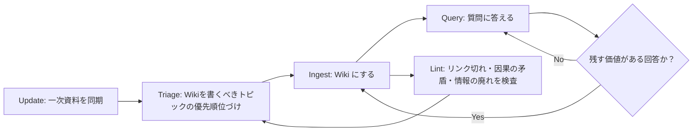

:::message
この記事は、[CYBOZU SUMMER BLOG FES '26](https://summer-blog-fes.cybozu.io/2026/)の記事です。
:::

デザインプロセスは合意形成の積み重ねです。チーム横断のステークホルダーと議論が発生する場面は珍しくなく、そのデザインに至るには何かしらの背景があります。「デザインシステム」は、まさしくこの合意形成の結果の一つとして存在するものです。

Figma の言葉を借りるならば、デザインシステムは「一貫性を保つための一連の構成要素と標準」です。大規模な開発において、デザインシステムは、プロダクトの目的を達成するために必要な「一貫した意思決定にかかる時間を大幅に短縮する手段」になり得ます。

> What exactly is a design system?
> At its core, a design system is **a set of building blocks and standards** that help keep the look and feel of products and experiences **consistent**. Think of it as a blueprint, offering a unified language and structured framework that guides teams through the complex process of creating digital products. **A design system can assist in reducing the amount of time spent recreating elements and patterns** while designing and building products and interfaces at scale.
>
> デザインシステムとは一体何なのか?
> デザインシステムの中核となるのは、製品やエクスペリエンスのルック&フィールの**一貫性を保つための一連の構成要素と標準**です。これは、デジタル製品を作成する複雑なプロセスを通じてチームを導く、統一された言語と構造化されたフレームワークを提供する青写真と考えてください。デザインシステムは、製品やインターフェースを大規模にデザイン・構築する際に、**要素やパターンを繰り返し作成するのに費やす時間を短縮する**のに役立ちます。
> -- [What Is a Design System | Design Systems 101 | Figma Blog](https://www.figma.com/blog/design-systems-101-what-is-a-design-system/)

「なぜこのデザインになったのか？」が参照可能な状態であることは、改善すべきデザインを改善できる「**柔軟性**」をもたらし、迷わず「**一貫した判断**」を行うことを助け、将来にわたって「**持続的に改善可能なデザイン**」を実現可能にしてくれます。

このように捉えるのであれば、**デザインに関する議論が参照可能であること**は、デザインシステムの構成要素になりえるほど、重要なことだと感じられます。

さらに、それらが**いつでも誰でも参照可能**であることが大事です。デザインチームやデザインシステムチームだけでなく、「プロダクトに関わる誰もが」デザインに関心を持ち、より良くしていけることにもつながるからです。

いずれが満たされなくても、デザインの変更に対する判断コストは高くなり、属人化し、持続的でオープンなデザインの改善は難しくなるでしょう。

## 課題

筆者が携わる kDS (kintone Design System) Team は、デザインシステムの開発運用や、他職種横断でのコミュニケーションを通して、デザインとエンジニアリングのコラボレーションを促進する専門チームです。

https://note.com/amishiratori/n/n0d8467106f27

kDS では日々膨大な量の議論が交わされ、デザインシステムに関する意思決定が行われます。他のメンバーが追いにくい職能横断での議論も多く行われます。冒頭の理由から、これまでチームは、努めてデザインに関する意思決定を残してきました。ほとんどの議論はオープンな場で行われますし、重要な議論は ADR を書いて、チームへの共有を徹底してきました。しかし、それでも実感している課題は多くありました。

- そもそも議論を ADR/ガイドライン化するかの基準が曖昧でケースバイケース
- ADR/ガイドラインがあっても思い出すこと自体に時間がかかり、時間が経つと形骸化する
- 先行事例・類似事例があるか否かすらわからなくなっている場合があり、長年いるメンバーの記憶に任される
- 新しく入ったメンバーが過去の経緯を追いにくく、属人化する
- デザイナー・エンジニアなど、他職能に意思決定の経緯が伝わりにくい
- 議論が行われる場所も統一していないので、検索しにくく、関連議論を探しにくい

kDS の場合、以下のようなプラットフォームで日々議論をし、意思決定を記録しています。

- GitHub: Issue、Pull Request、Discussion、Storybook のガイドライン
- Slack
- Confluence
- kintone 上のコミュニケーション
- Figma
- Zoom の議事録

何らかの形で記録はされているものの、それが分散し、形骸化しているため、結局のところメンバーの記憶頼りになってしまう場面も少なくありませんでした。その場で覚えているメンバーがいなければ、本来別のことに割ける工数を、経緯調査に消費しなければなりません。また、他職能にとって難易度は依然高く、kDS チームに質問が来てそれに回答するといったコミュニケーションコストの課題感もありました。

kDS チームには、幸いなことに、テキストベースでコミュニケーションしたり、議事録を取ったりする文化は根付いていました。あとは、分散してしまって参照しづらい/されづらい情報を、フルに活かしてあげたいです！

## LLM-Wiki

そこで新たに活用を始めたのが、[LLM-Wiki](https://gist.github.com/karpathy/442a6bf555914893e9891c11519de94f) です。

LLM-Wiki 自体は、単なる概念というか、LLM に Wiki（ドキュメント）の保守を任せるためのパターンです。このパターンを手元の Agent に渡して「xx についての LLM-Wiki を作って」と指示するだけで、実際にドキュメント検索ツールができます。このファイル自体が LLM-Wiki を作成するための Skills のような立ち位置になっていると考えると、わかりやすいでしょう。

https://gist.github.com/karpathy/442a6bf555914893e9891c11519de94f

### 構成要素

主に次の3つです。

#### `raw/`

LLM が突っ込む一次資料。LLM が読み書きするもので、手動では編集しない。

#### `wiki/`

一次資料を参考に執筆され、LLM が保守するドキュメント。ヒューマンリーダブルであり、例えば以下のような感じ。次に述べる `Query` したり `Ingest` したりすることで、Wiki はどんどん太く、リッチになっていく。

#### `AGENTS.md`

AI Agent をドメインの「Wiki メンテナ」にするための土台となる設定。基本的には、「何を一次資料とするか」「どう引用するか」「記録がなければどう答えるか」「どう運用するか」といったことを定義する。元の gist のままではチームで運用するには結構足りないことになると思うので、ここをゴリゴリとカスタマイズしていくことになります。そういう意味で、その LLM-Wiki の色が最も反映される。

### 操作

LLM-Wiki の基本的な操作は、大体以下の3つです。

- **`Query`**: Wiki に質問し、有用な回答を Wiki に記録し、使いまわせるようにする
- **`Ingest`**: `raw` を読み、既存のページとつないで Wiki をアップデートする
- **`Lint`**: 矛盾、古い記述、孤立したページ、出典不足を検査する

`raw` に一次情報を渡し、`Ingest` して `wiki` を書き、質問を `Query` して良い回答は `wiki` に保存し、`Lint` で全体をアップデートして掃除する、というようなワークフローになります。

kDS ではこれに加えて、以下を追加して運用しています。

- **`Update`**: 各ドキュメントサービスから一次情報を `raw` に同期し、検索用のインデックスを更新する
- **`Triage`**: 新しく増えた一次情報や Wiki の不足を調べ、次に `Ingest` する対象と追加調査が必要なトピックに優先順位を付ける
- **`Backfill`**: 過去の一次情報を遡り、既存ページの経緯とカバー範囲を補完する

現状は、以下のようなサイクルを回す運用です。



### メリット

大量の一次情報から回答してくれるという意味で、RAG と LLM-Wiki は似ています。一方、RAG は検索結果から毎回回答を組み立てるので、以前も検索した内容を参照できずトークンコストが嵩んだり、回答の質もモデルによってバラバラだったりします。

LLM-Wiki は、回答を Wiki として残し、`Ingest` する度に関連する知識同士を接続していきます。`Ingest` するコストを一度ペイすれば、その結果は次回から `Query` で参照可能になります。`Query` で良い回答が出せれば、それは Wiki ネットワークに蓄積されます。使えば使うだけ、雪だるま式に質の良い回答を出せるように成長するのが、LLM-Wiki の特色です。賢いモデルを使って `Ingest` し、Wiki を作れば、次回からは質の高い回答が比較的高速に得られます。

複数リソースにそれぞれ MCP を繋いだ Agent に検索させるより効率的なのも、同じ理由です。LLM-Wiki は raw からのみデータを取得するので、MCP に比べてトークンを節約でき、安定した質の回答を高速に得られる傾向にあると言えます。

## デザインシステムでの活用

### チーム内で活用する

影響範囲が大きなデザインの変更は、しっかりと背景事情を調査して、変更の可否を判断するのも kDS チームの仕事の一部です。

直近では Form Controls 系コンポーネントのフォントサイズが 14px と 16px で揃わないデザインとなっていました。

本来であれば調査タスクとして切り出され、誰か工数を割いて過去の経緯を遡る必要があったかもしれません。しかし、LLM-Wiki のおかげで、あらゆる場所に散らばっていた経緯をものの数分で遡って整理することができ、１往復のコミュニケーションで話が完結しました。

この時点で大変便利なのですが、チーム内の議論を円滑に進めるだけではなく、職能を超えたコミュニケーションコストのカットにも役立っています。

### エンジニアチームが活用する：「どうしてこんな実装になっているのか？」

コンポーネントライブラリがその実装になっている経緯を調べることもできます。

デザインシステムの React コンポーネントと Figma は基本的に同一の見た目ですが、何らかの拍子で見た目がずれてしまうことがあります。開発チームから、「どうして実装では余白があるのか？ Figma にはないから、Figma に合わせてこの余白を実装から消してもいいか？」という質問がありました。

こういった質問には、kDS メンバーはコンテキストを知っているので答えらえますが、今のメンバー以外が答えるのは難しいです。そういった場合でも、開発チームは LLM-Wiki に質問をそのまま投げがけることができます。実際の返答は以下のようなものでした。

:::details 実際の返答例

```txt
❯  対象コンポーネントについて現実装とデザインを見比べると、一番下の要素が境界線ではなく、その少し上で見切れています（スクリーンショットで赤丸を付けた箇所）。境界線で見切れるように修正しても問題ないでしょうか？[Image #1]

...

結論: 「境界線の少し上で見切れる」挙動は意図された仕様です。境界線で見切れるように戻す修正は推奨しません。

これはバグではありません。操作領域への誤タップを防ぐため、スクロール領域と操作領域の間に、スクロールしない余白を設けています。修正が必要なのは、実装の仕様変更に追随していないデザイン側です。

経緯（出典付き）

1. 社内の質問・相談記録 — 本文と操作領域の間隔が狭く、誤タップの懸念が報告されました。関係者で検討した結果、本文の下に一定の余白を設ける方針で合意しています。→ raw / internal Q&A
2. 関連 Issue → Pull Request で実装。Pull Request の説明には、次のように記録されています。

▎ （出典: Pull Request の説明、原文のまま）
▎ - padding-bottom: スクロールコンテナの内側に余白が入るため、最後までスクロールしたときのみ余白が現れる。スクロール途中では効果なし。
▎ - margin-bottom（採用）: スクロールコンテナの外側に余白が入るため、どのスクロール位置でも常に操作領域との間に一定の余白が確保される。

3. 仕様の意図は、社内チャットでも明確に説明されています。

▎ （出典: 社内チャット、原文のまま）
▎ 操作領域上部の境界線より上に、本文がオーバーフローしてもスクロールしない余白を設ける仕様です。

つまり、「コンテンツが境界線の少し上で見切れる」こと自体が受け入れ条件でした。

現実装とデザインの差異

- 実装（メインブランチ）: 操作領域の上に余白があり、その下に境界線があります。当初は本文側に余白を設けていましたが、「操作領域がない場合にも不要な余白が付く」というレビューを受け、操作領域側へ移されました。
- デザイン: スクロールする例を確認すると、本文のクリップ境界と操作領域の上端が接しています。実装にある非スクロール余白は反映されていません。

なお、スクリーンショット自体は確認できていません。ただし、「要素が境界線の少し上で見切れる」という現象は、実装されている余白の効果と一致します。

次のアクション候補

1. 実装は変更せず、操作領域の上に非スクロール余白を設ける現在の仕様に合わせて、デザインを更新するよう依頼します。
2. 今回確認した経緯を、コンポーネントの設計判断としてナレッジベースに記録します。
```

:::

非常に高い精度で根拠付きの回答を得られ、ネクストアクションまで示してくれました！これまでデザインシステムチームに聞かなければできなかった判断を、開発チーム内できるようになった一例です。

### デザインチームが活用する：「どうしてこんなデザインになっているのか？」

デザインチームがそのデザインになった経緯を自発的に調べることもできます。

あるコンポーネントのレイアウトデザインを変更する検討が持ちかかりました。そのコンポーネントの最低幅が 210px になっていたのですが、理由がわからず、変更可能なデザインなのか判断ができませんでした。

そこで、デザインチームが LLM-Wiki を利用したところ、以下のような回答が返ってきました。

:::details 実際の返答

```txt
対象コンポーネントの最低幅（min-width: 210px）の経緯

「210px」という数値自体の根拠は記録されていません。一方、「固定幅ではなく最低幅にした」理由は、アクセシビリティ監査への対応として明確に記録されています。

経緯（時系列）

1. 210px の由来 — 既存実装からの移植

[Pull Request A]で、既存プロダクトのコンポーネントとして切り出した際、固定値の width: 210px がそのまま移植されました（commit <commit-a>）。

Pull RequestとIssueには、なぜ210pxなのか説明がありません。そのため、「値の根拠は記録されていない」が正確です。

2. 固定幅から最低幅への変更 — アクセシビリティ監査対応

きっかけは、アクセシビリティ監査で見つかった問題を報告する[Issue B]です。

▎ （出典: Issue本文）
▎ テキストのサイズを200%に拡大した際、確認画面にあるボタンから文字がはみ出していました。文字と画面背景が同系色になる箇所では、はみ出した文字を読めなくなっていました。

これは顧客企業様のアクセシビリティ監査での指摘で[Pull Request C]によってwidth: 210pxからmin-width: 210pxへ意図的に変更されました（commit <commit-b>）。

つまり210pxは、「最低限の幅を確保しつつ、文字を拡大した場合はコンテンツに合わせて広がる」ための下限として残された値です。
```

:::

特に理由なく以前の px が残っているという事実を返してくれました。理由がないのであれば、デザインを再検討できます。さらに、アクセシビリティ上の理由により、意図して `width` から `min-width` に変更された経緯も出力してくれました。デザイナーは、`width` ではなく `min-width` の利用を意識することもできるでしょう。

## 運用上の工夫

LLM-Wiki をチームで運用する際に工夫した設計観点をシェアしたいと思います。

### LLM が読める範囲を機械的に絞って管理する

社内情報を扱う以上、一般情報以外をどのように扱うかが真っ先に注意したいポイントです。Slack や Confluence には非公開なスペースも含まれます。

取得する情報は、確実に管理し、機械的に制限したいです。kDS の LLM-Wiki では、**Wiki が引用してよい情報を `raw/` に存在する内容だけに制限**しています。また、Python 製の sync スクリプトを用意し、同期をするためにはこれを利用します。**sync スクリプトは allowlist を参照しており、allowlist で全ての接続先を一元管理**しています。追加されていない先にはスクリプトは接続できません。

```py
"""Canonical allowlist for every external source mirrored by this repository.

Review this file to see the complete acquisition boundary. Adding a repository,
space, channel, app, or kintone field requires a code change and review.
Sync scripts import these definitions and reject resources not listed here.
"""

# GitHub repositories. Issues, pull requests, and Discussions are mirrored;
# repository source code is not.
GITHUB_REPOSITORIES = (
)

# Confluence tenant and space. Explicit page URLs are accepted only in this
# space; otherwise every root page in the space is discovered automatically.
CONFLUENCE_SITE = "https://sharedoc.atlassian.net"
CONFLUENCE_CLOUD_ID = ""
CONFLUENCE_SPACE_KEY = ""

# Slack tenant and public channels. DMs and private channels are outside the boundary.
SLACK_API_BASE = "https://slack.com/api"
SLACK_WORKSPACE_URL = "https://"
SLACK_CHANNELS = {
}

# kintone tenant, apps, and field-level allowlists. The common fields are
# mirrored for every app; each app then adds its own title, questioner,
# exclusion flag, and content fields below.
KINTONE_API_BASE = "https://"
KINTONE_COMMON_FIELDS = {
}
KINTONE_APPS = {
}
```

もちろん、公開 channel の本文に機微な情報が書かれている場合までは、自動で判定できないため、別途必要な確認も挟みます。

### 目的をはっきりさせる

LLM-Wiki は、リソースが増えるほど、ノイズも増え、判断を誤りやすくなるとされています。そのため**情報は目的に沿って、できるだけ的を絞ったものに限定する**ことが効果的です。

例えば kDS の場合は「デザインシステムの合意形成の経緯を追う」ことが目的です。目的がはっきりしていると、それに関連する必要な情報を取捨選択でき、無駄な情報や実装を追加しないで済みます。

もし、kDS LLM-Wiki の目的が「コンポーネントライブラリの実装の実装の経緯を追う」ことであれば、Slack のデザイナースレッドや Confluence はそこまで重要ではなかったでしょう。

### データの重みづけ

LLM-Wiki を作成する際は、目的に沿ったまとまりのある情報から優先的に追加していきました。まとまったガイドラインや ADR から始め、補いきれなければ、少し粗い手の加えられていない議事録・チャットなどのデータも足していくという感じです。

こうして情報が増えると、 **最終的に何が採用されたんだっけ？** というのが見えにくくなるのがデメリットです。

そこで、ある程度チームの意思決定プロセスに合わせて、**情報の確度順に重み付け**を定義しました。例えば、実装に反映されたマージ済み Pull Request は、Slack 上の会話よりも強い根拠として扱います。チームの意思決定プロセスに合わせ、`マージされた PR > ガイドライン > ADR > Discussion > ... > 議事録` といった重み付けをしいます。

順序は、チームによって異なる可能性があります。ADR が最も強いチームもあれば、仕様リポジトリの変更だけを正式な決定とするチームもあると思います。

### 双方向リンクで関連情報を逆引きする

「この Issue はどの Slack thread や Confluence で参照されたか」といった **「逆引き」** は、通常の検索では非常にやりにくいものです。GitHub であれば、Issue をメンションした PR を Issue から辿れたりする機能がありますが、プラットフォーム非依存でこの機能はありません。

一次資料に含まれる参照を index 化し、逆引きできるようにしました。これにより、ある PR から元の Issue をたどり、その Issue を参照する Confluence や Slack thread を見つけるということができるようになります。最終的な変更だけでなく、変更のきっかけや反対意見までたどれます。

双方向にリンクしておくと、機械的に関連を読み取れるため、速く、正確で、再現性の高い検索結果が得られます。欠かせない機能の一つです。

### Git の履歴を活用する

「いつのタイミングでなぜこの実装になったのか？」を知るためには、ソースコードに加え、Git の履歴、特に `blame` がしたくなります。

実装の経緯を調べるときは、**該当行の `blame` から変更した commit を特定し、紐づく Pull Request や Issue まで遡れるように**しています。main のコードだけではわからなくても、変更を追加した Commit メッセージや PR に手がかりが残っている場合もカバーできます。

先に述べた [### エンジニアチームが活用する](#エンジニアチームが活用する：「どうしてこんな実装になっているのか？」) の例は、これを実装したことによって、劇的に回答が改善しました。

## TODO

より運用しやすくするために、まだまだ改善できる点はあります。特に、データをコスパよくメンテナンスする上で、CI 周りを整備していく価値は高いです。

### データの Auto Sync

GitHub、Slack、Confluence、kintone、Zoom からの情報は日々更新されるため、`raw` を定期的にアップデートする必要があります。

現在の同期処理は個人の環境と認証情報に依存しており、各人が気づいたとき（毎日使うのでほぼ毎日）アップデートしています。

### ホスティング

現状 Wiki は個々人がリポジトリをクローンして、ローカルの Agent を使って利用する形になっています。

しかし、デザインシステムの意思決定を参照する人は開発者からデザイナ、それ以外のステークホルダに渡る可能性もあります。そういった人たちは必ずしも Wiki になにか追加編集したいわけではなく、それこそ単なる検索サービスの用途で利用したいケースがほとんどです。今の Git ベースの運用では、Git になれていない人へ活用が広がらない可能性が高いです。

Wiki を「質問する人」と「育てる人」は分けて考えられます。

「質問するだけの人」向けには、クラウドの AI サービスを利用して、ブラウザから質問できるようにする形も考えられるでしょう。ただし、クラウド側は基本的に read only に留めたいです。

### Wiki の競合

複数人で Wiki をメンテすると、同じ Wiki を複数人が編集するタイミングが出てきます。

しかし、Wiki のコンフリクト解消をするのもあまり本質的ではありません。人間にとっては `Query` した結果が大事なため、Wiki の内容は最悪 AI が参照できれば良いからです。

この前提だと、各 Wiki ファイルは、末尾にそれぞれが追記していくルールでも良いかもしれません。内容は重複しますが、同じファイルを複数人で編集してもコンフリクトはしなくなります。大事なのは `Query` した結果なのであれば、これでも大きな問題にはなりにくそうです。

もちろん Wiki を人間が参照しない可能性がゼロであるかと言われると、そうとは言い切れません。Wiki を定期的に整える必要があるとなると、`Lint` を CI に組み込み、CI 上で Agent に実行させる運用が必要になるでしょう。

## おわりに

kintone Design System チームのミッションは **「kintone についてアウトプットする人たちが、一貫性あるユーザー体験とデザインの品質を、ユーザーに提供できる状態をつくること」** です。

しかし、そのパーツであるデザインシステムのコンポーネントも、Figma も、デザイントークンも、ガイドラインも、ある日突然完璧なものができるわけではありません。

ユーザのニーズがある限り、デザインもプロダクトの体験も日々改善が検討されます。そのアイディアを泥臭く議論し、ステップを踏みながら徐々に「より良い」状態を目指していきます。最初から完璧なものは作れませんし、いつ完璧が来るのか読めるものでもないでしょう。

だからこそ、「より良い」状態を目指すために、解像度高く現状を捉えることに意味があります。「なぜこうなったのか？」「どういうニーズがあったのか？」「他には何が検討されたのか？」「誰がどう関わっていたのか？」という、「議論」や「背景」を理解するステップは、その手段として効果を発揮できます。

現状を深く理解し、事実に即した効率の良い議論を産むことは、絶え間なく変化するユーザ・デザインのニーズを少しでも予測し、一貫したより良いデザインを作る鍵になるはずです。

デザインシステムの議論から丸ごと LLM-Wiki 化することは、それを実現するデザインシステムの新しい形となり得るかもしれません。

---

https://cybozu.co.jp/recruit/entry/career/design-technologist.html

https://note.com/cybozu_design/m/mdc4ac766dcfc

https://note.com/cybozu_design/m/mc12622f890cf

## 参考

- [llm-wiki — Andrej Karpathy](https://gist.github.com/karpathy/442a6bf555914893e9891c11519de94f)
- [Web 標準の議論を LLM-Wiki で追う | blog.jxck.io](https://blog.jxck.io/entries/2026-06-29/tc39-llm-wiki.html)
- [ry/llm-wiki-starter](https://github.com/ry/llm-wiki-starter)
