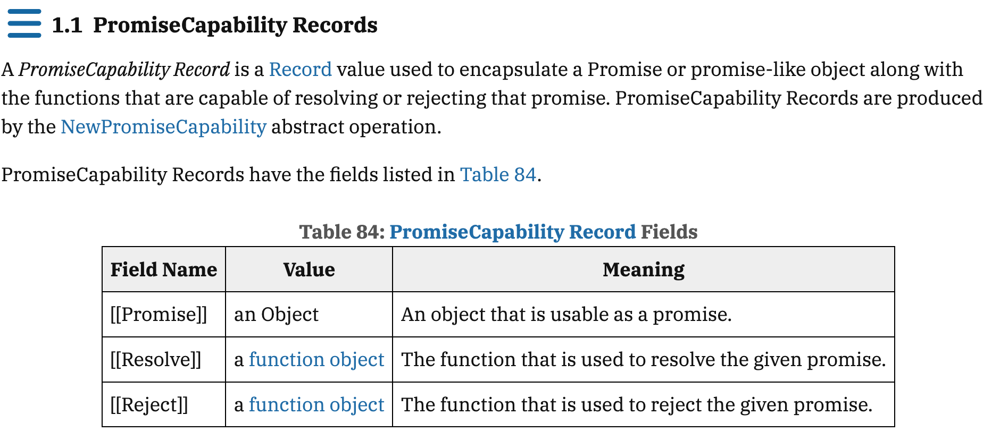

:::message
この記事は、[CYBOZU SUMMER BLOG FES '24](https://cybozu.github.io/summer-blog-fes-2024/) (Frontend Stage) DAY 9の記事です。
:::

<!-- # Practice Safe DSD with setHTMLUnsafe -->

[Interop 2024のFocus Areas](https://web.dev/blog/interop-2024?hl=ja#all_focus_areas_for_2024)となっているWeb Componentsに関する新機能の一つに、Declarative Shadow DOMがあります。

`<template>`における`shadowrootmode`属性がFireFox123で対応したことを以て、Declarative Shadow DOMが全ての主要ブラウザで利用可能になり、Baselineに追加されました。

https://caniuse.com/?search=Declarative%20Shadow%20DOM
https://webstatus.dev/features/declarative-shadow-dom

このDeclarative Shadow DOMに紐づく新たなAPIとして、`setHTMLUnsafe`や`parseHTMLUnsafe`がUnsanitized HTML parsing methodsとして最近Baselineに追加されています。

https://webstatus.dev/features/parse-html-unsafe

今回は、Declarative Shadow DOMとは何かとその期待される使いどころ、そして`setHTMLUnsafe`や`parseHTMLUnsafe`を使ってShadow DOMに動的コンテンツを追加する方法について紹介します🌼

## Shadow DOM is 何?
Shadow DOMは、[Web Components](https://developer.mozilla.org/ja/docs/Web/API/Web_components#%E6%A6%82%E5%BF%B5%E3%81%A8%E4%BD%BF%E7%94%A8%E6%B3%95)を構成する技術の一部として、Webページから完全に隔離されたDOMツリー(Shadowツリー)とそれに関連するスタイルを定義するための技術です。

<!-- ここでいう「カプセル化」の指す機能は以下の二つです。

- Isolated DOM: Shadow DOM は自己完結であり親 DOM から影響を受けない・影響しない。
  - e.g. `document.querySelector()` などの影響を受けない
- Scoped CSS: Shadow DOM 内部の CSS は親 DOM のスタイル定義の影響を受けない -->

Shadow DOMを使用することで、Webページの一部を隔離されたDOM（`#shadow-root`）としてレンダリングし、そこに対してのみスタイルや機能を適用することが可能になります。これにより、Webページ全体のスタイルや機能の影響を受けることなく、特定の部分だけを変更できます。


### Shadow DOM の作成方法

Web Componentsの文脈において、Shadow DOMは以下のようにして作成することができます。

1. `customElements.define`を呼んでCustom Elementを定義
2. `this.attachShadow({mode: 'open'})`でShadow DOMを作成し、要素に紐づける
3. `shadowRoot.innerHTML`などでShadow DOMに要素を追加

```js:Shadow DOM作成の手順
class ShadowHostCustomElement extends HTMLElement {
  connectedCallback () {
    this.attachShadow({ mode: "open" });
    this.shadowRoot.innerHTML = `
      <style>
        h1 {
          color: red;
        }
      </style>
      <h1>🙈 This is Shadow DOM 🙈</h1>
    `;
  }
}

// Custom Elementを定義
window.customElements.define("shadow-host-custom-element", ShadowHostCustomElement)
```

```html: レンダー後
<shadow-host-custom-element>
  #shadowRoot
  <style>
    h1 {
      color: red;
    }
  </style>
  <h1>🙈 This is Shadow DOM 🙈</h1>
</shadow-host-custom-element>
```

:::message
HTML要素の中には、Shadowツリーを紐づけることができない要素があります。
詳しくは「[有効なshadow host](https://dom.spec.whatwg.org/#valid-shadow-host-name)」の項目を参照して下さい。
:::
<!-- custom elementを使ってShadow DOMを作成することで、Web Componentsを構築することができることまでいう？ -->

## Shadow DOMの欠点

コンポーネント指向の開発において、Shadow DOMは非常に便利な技術ですが、以下のような点を考慮する必要がありました。

- JavaScriptが使用できない環境では動作しない
- Web Componentsは遅延ロードされるため、Cumulative Layout Shift (CLS)を引き起こす可能性がある
- Shadow DOMはクライアントサイドJavaScriptでのみサポートされており、サーバーサイドで記述できる構文が存在しないため、SSRができない

これらの問題は、Shadow DOMがクライアントサイドJavaScript環境でのみサポートされるWeb APIであることに帰結すると言えるでしょう。

そこで登場したのが、Declarative Shadow DOMです。

## Declarative Shadow DOM is 何？

Declarative Shadow DOM is **Shadow DOM without JavaScript**です👏🏻

### Declarative Shadow DOM が解決したこと

[従来のShadow DOMの作成方法](#shadow-dom-の作成方法)は、JavaScriptでShadowRootを作成し、その中に要素を追加する方法でした。
つまり、Webページを読み込んでそれがレンダーされてからやっとJavaScriptが実行され、Shadow DOMが生成されていました。

しかし、DSDを使うと、ブラウザのレンダリングエンジンにShadow DOMを作るように指示することができます。
これにより、Custom Elementの定義を含むJavaScriptのHydrationを待つことなく、Shadow DOMを構築できるようになります。加えて、CLSを引き起こさずにコンポーネントをレンダリングできたり、SEOの面でも恩恵を受けたりすることができます。

### Declarative Shadow DOM の使い方

DSDを使用すると、以下のようにShadow DOMを作成することができます。

1. Web Componentsのカスタム要素を定義
2. `<template>`要素を使ってShadow DOMの構造を定義
3. `<template>`要素のshadowrootmode属性にopenを指定
4. `<template>`要素の中にShadow DOMに追加したい要素を記述

```html: Declarative Shadow DOMの使い方
  <body>
    <shadow-host-custom-element>
      <template shadowrootmode="open">
        <style>
          h1 {
            color: red;
          }
        </style>
        <h1>🙈 This is Shadow DOM 🙈</h1>
      </template>
    </shadow-host-custom-element>
  </body>
```

試しに、JavaScriptを無効化した環境でShadow DOMが構築されるか確認してみます👀

<!-- githubのリンクと動画を貼る -->

[従来のShadow DOMの作成方法](#shadow-dom-の作成方法)でやっていた、JavaScriptでShadowRootを作成したり、要素を追加する手順がHTMLで完結していますね！

## `setHTMLUnsafe`・`parseHTMLUnsafe`でShadow DOMに動的コンテンツを追加する

innerHTML や DOMParser との比較です

`setHTMLUnsafe`や`parseHTMLUnsafe`を使うことで、動的コンテンツをShadow DOMに追加することができます。

宣言型 Shadow DOM は HTML パーサーの機能です。つまり、宣言型シャドウルートは、HTML 解析中に存在する shadowrootmode 属性を持つ <template> タグに対してのみ解析され、添付されます。つまり、宣言型シャドウルートは最初の HTML 解析時に構築できます。


<some-element>
  <template shadowrootmode="open">
    shadow root content for some-element
  </template>
</some-element>
<template> 要素の shadowrootmode 属性を設定しても何も行われず、テンプレートは通常のテンプレート要素のままです。


const div = document.createElement('div');
const template = document.createElement('template');
template.setAttribute('shadowrootmode', 'open'); // this does nothing
div.appendChild(template);
div.shadowRoot; // null
セキュリティ上の重要な考慮事項を回避するため、宣言型シャドールートは、innerHTML や insertAdjacentHTML() などのフラグメント解析 API を使用して作成することもできません。宣言型シャドウルートが適用された HTML を解析する唯一の方法は、setHTMLUnsafe() または parseHTMLUnsafe() を使用することです。


<script>
  const html = `
    <div>
      <template shadowrootmode="open"></template>
    </div>
  `;
  const div = document.createElement('div');
  div.innerHTML = html; // No shadow root here
  div.setHTMLUnsafe(html); // Shadow roots included
  const newDocument = Document.parseHTMLUnsafe(html); // Also here
</script>


将来的には`setHTML`や`parseHTML`のサポート。
https://www.mitsue.co.jp/knowledge/blog/frontend/202407/04_0815.html

## Declarative Shadow DOM の使いどころ

[Maybe you don't need Declarative Shadow DOM at all?](https://www.wiktorwisniewski.dev/blog/exploring-declarative-shadow-dom#javascript)

https://developer.chrome.com/blog/new-in-chrome-124?hl=ja#dsd
https://thathtml.blog/2024/01/dsd-safety-with-set-html-unsafe/

## Web Components ってなんで欲しかったんだ？


React/Vue/Angularでも良いのでは？
他のライブラリに依存せずに、web標準でコンポーネントを作成できる

再利用性: Web Componentsは独自の要素を定義することで、これを他のプロジェクトやページで再利用できます。
カプセル化: Shadow DOMを使用することで、コンポーネント内のスタイルや振る舞いを隠蔽し、外部からの影響を受けにくくします。
フレームワーク非依存性: Web Componentsは標準のWeb技術で構築されており、他のフレームワークに依存せずに使用できます。（異なるフレームワーク間で再利用可能なコンポーネントが作成できる）

 The benefit of that is performance because we are running code that is closer to the native API rather than framework abstraction layer.

 The second benefit is portability of the given component across multiple projects - even these that use frameworks like React / Angular / Vue under the hood. 

https://www.docswell.com/s/jxck/5246NN-1st-year-of-webcomponents-v4#p24

## まとめ

DSDを使用することで、Progressive EnhancementなWeb Componentsの構築に近づきました。
Web Componentを構成するCustom Elementの登録がまだ宣言的ではない（Proposalはある：https://github.com/WICG/webcomponents/blob/gh-pages/proposals/Declarative-Custom-Elements-Strawman.md）

https://web.dev/blog/interop-2024?hl=ja#declarative-shadow-dom
https://developer.mozilla.org/ja/docs/Web/API/Web_components/Using_shadow_DOM
https://www.wiktorwisniewski.dev/blog/exploring-declarative-shadow-dom
https://www.konnorrogers.com/posts/2023/what-is-declarative-shadow-dom
https://thathtml.blog/2024/01/dsd-safety-with-set-html-unsafe/
https://webstatus.dev/features/parse-html-unsafe?q=baseline_date%3A2024-03-01..2024-07-24+
https://chromestatus.com/feature/6560361081995264
https://www.mitsue.co.jp/knowledge/blog/frontend/202407/04_0815.html
https://developer.chrome.com/blog/new-in-chrome-124?hl=ja#dsd
https://html.spec.whatwg.org/multipage/dynamic-markup-insertion.html#unsafe-html-parsing-methods
https://blog.jxck.io/entries/2023-01-07/new-css-capabilities-for-component.html
https://speakerdeck.com/uhyo/shadow-domtocssnoxian-zhuang
https://www.docswell.com/s/jxck/5246NN-1st-year-of-webcomponents-v4#p11
https://qiita.com/tronicboy/items/68f2d9ae1c93a9c3f2cb
https://github.com/WICG/webcomponents/blob/gh-pages/proposals/Declarative-Custom-Elements-Strawman.md
https://github.com/WICG/webcomponents/blob/gh-pages/proposals/Declarative-Shadow-DOM.md

> 宣言型 Shadow DOM は HTML パーサーの機能です。つまり、宣言型シャドウルートは、HTML 解析中に存在する shadowrootmode 属性を持つ <template> タグに対してのみ解析され、添付されます。つまり、宣言型シャドウルートは最初の HTML 解析時に構築できます。

https://developer.chrome.com/docs/css-ui/declarative-shadow-dom?hl=ja